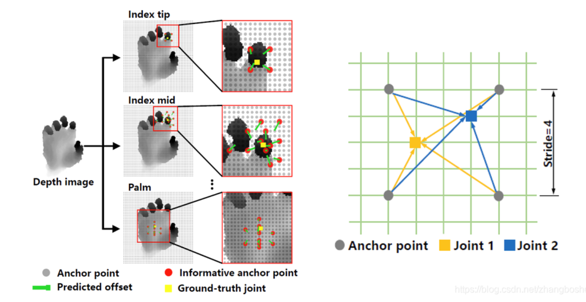
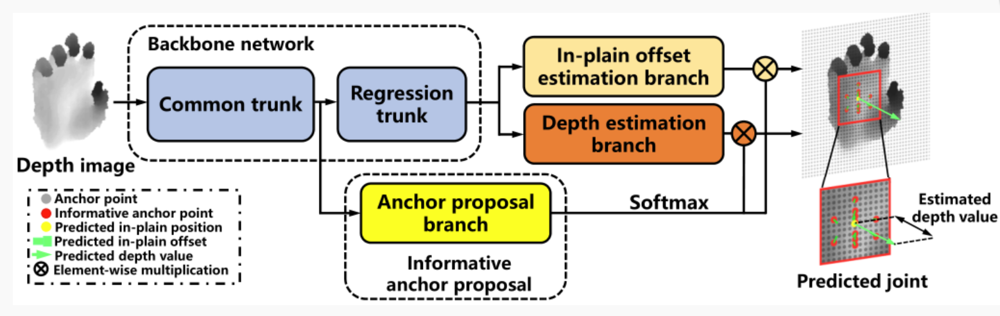
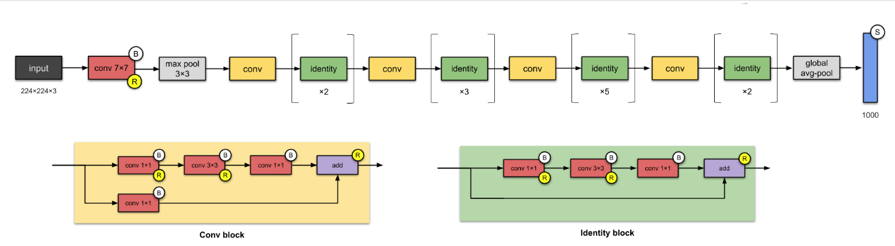
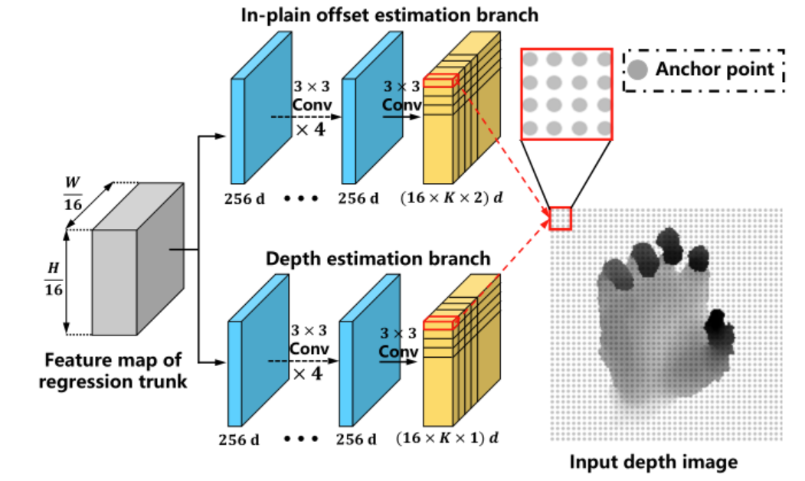
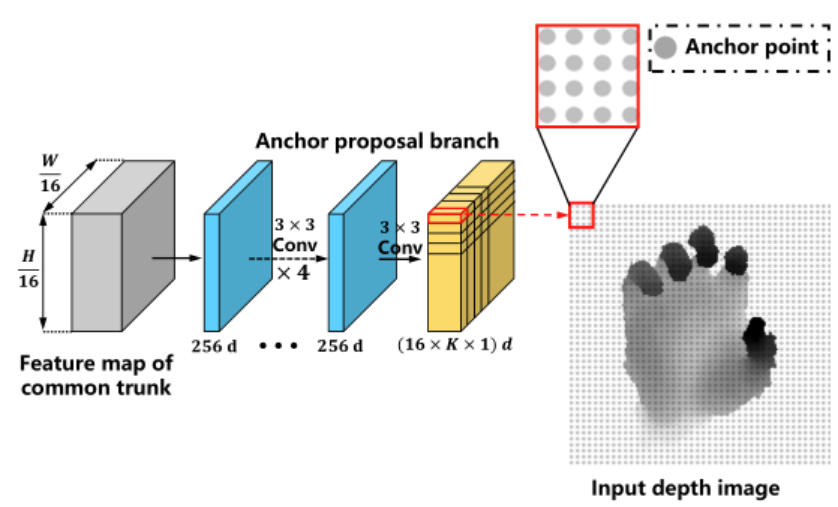
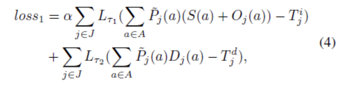
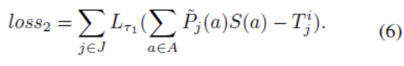
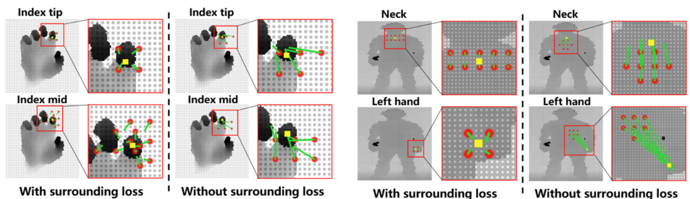
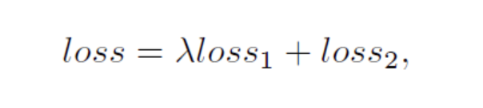
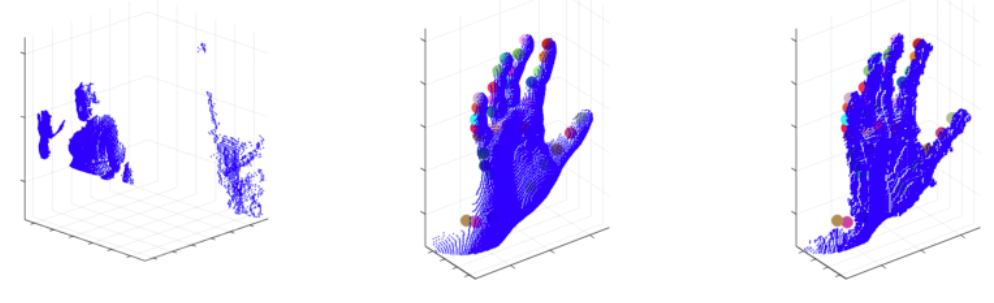

# A2J：Anchor-to-Joint Regression Network for 3D Articulated Pose Estimation from a Single Depth Image

### <div align = "right">——手部关键点坐标检测</div>
<div align = "right">小组成员：林世豪 刘俊彦 张钰迎  </div>


##1. A2J介绍

### 简述：
该篇文章发布于2019年的ICCV，并获得了2019年hand pose挑战赛第一名的成绩。

该文针对深度图像中的三维手和人体姿态估计问题，提出了一种具有端到端学习能力的基于锚的联合回归网络（A2J）方法。
在A2J中，能够捕获全局局部空间上下文信息的锚定点被密集地设置在深度图像上，作为关节的局部回归。它们有助于以集成方式预测关节的位置，提高泛化能力。
提出的三维关节姿态估计方法不同于现有的基于FCN、3D-CNN和基于点集的编码器-解码器。
为了发现指向某一节理的信息锚定点，
该文章还提出了A2J的锚点建议程序，同时采用二维CNN（即ResNet-50）作为骨干网络驱动A2J，
而不使用耗时的三维卷积或反卷积层。
在3个手部数据集和2个身体数据集上的实验验证了A2J的优越性。
同时，A2J在单个NVIDIA1080TIGPU上的运行速度高达100fps左右。

论文地址： https://arxiv.org/abs/1908.09999.

### Anchor-to-Joint 解析：

首先给出两张paper中的示意图。左图是技术方案的一个流程示意，
对于一张给定的输入深度图片（这里假设输入仅包含单个手或人体，
前面需要一个检测器的预处理步骤，类似于human pose的Top-down思路），
我们密集的在图像上设立anchor point，如右图所示，每隔stride = 4个像素点就会设立一个anchor point，
最终的关节点预测将会通过这些anchor point去完成。
具体而言，每个锚点需要针对所有关节点预测一个图像坐标下的偏移量（左图中的绿色箭头）以及一个深度值，
最终的关节点坐标将由所有锚点加权投票得出
（权重是可学习的，左图中红色的anchor point就是权重值比较大的点，
称之为informative anchor point）。




##2. 模型说明

###2.1 基本架构
作者认为每个anchor point对每个关键点坐标贡献都应程度并不一致，
所以最后就是求所有anchor points 对每个关键点坐标求加权和,
因此为了实现上面的思路，采取的技术流程如下图所示。



A2J 网络由3个分支组成，由 2D CNN 骨干网驱动。这 3 个分支分别负责预测锚点与节点之间的平面偏移量、估算节点深度值和提供锚点候选信息。

Backbone在实验中主要基于ResNet50，
输出包含三个分支，一个是图像坐标系下面的偏移量输出，一个是深度值输出，最后一个是对anchor point进行加权的anchor proposal分支输出。
第三支的输出结果经过softmax之后直接乘在前面两支的输出结果上对anchor point投票进行权重赋值。

###2.2 backbone结构

上面提到Backbone基于ResNet来提取特征，事实上作者对ResNet的结构进行了一些小的调整，使得最终编码得到的特征是经过16倍下采样的（而不是32倍）。



###2.3 偏移量和深度预测分支

本质上，这两个分支旨在预测关节的三维位置。它们都包含4个256通道的中间卷积层，以及 1 个输出卷积层。



###2.4 Anchor权重分支

该分支通过权重分配发现特定关节的信息性锚点，锚候选分支建立在骨干网内公共主干的输出特征图上，涉及较细的特征。



###2.5 损失函数

对于损失函数的选择，我们使用SmoothL1作为距离衡量标准，最终的损失包括loss1和loss2两项。

loss1 用于衡量预测值与GT之间的差异,在A2J中，锚定点作为局部回归量，以整体方式预测节理的三维位置



作者称loss2为Informative anchor point surrounding loss，这个loss的意义在于控制Informative anchor point的空间分布，
希望最终的Informative anchor point可以从关节点的各个角度去观察预测，进而加以下面的约束。



loss2 实际是上是一个正则项，可以有效地缓解过拟合现象，最终的效果也非常显著，
如下图所示，有无loss2的时候Informative anchor point的位置分布差异很大：



最终的损失如下,其中 lamda 是平衡损失1和损失2的权重因子：



## 3.模型训练和测试

### 3.1 模型训练


通过在深度图像上密集设置 A2J 内的锚点，获取全局-局部空间上下文信息，集成预测关节位置。

对输入的深度图像进行裁剪，并将其大小调整为固定的分辨率,在平面上随机旋转，在平面和深度上随机缩放，同时随机加入高斯噪声概率为0.5，用于数据增强。我们使用Adam作为优化器,在所有情况下，学习率都设置为0.00035，权重衰减为0.0001。A2J在纽约大学接受了34个学时的培训，每10个学时学习率下降0.1
每一次训练计算真实位置、深度与预测结果的损失值，将各种损失进行加和得到最终的损失，逐步迭代更新预测关节的位置和深度。

### 3.2 模型测试

利用之前训练好的模型权重来对测试集进行预测，计算测试计算指标。

在手部数据集方面，使用平均3D距离误差和成功帧百分比度量作为评估标准。


## 4.模型配置

###4.1 硬件(支持CUDA的GPU)
    使用支持CUDA的GPU处理器来搭建硬件环境
###4.2 深度学习框架
    Pytorch 1.12
###4.3 相关功能包
    numpy 1.23
    torchivision 0.13
    opencv-python 4.5.4.36
    os 
    tqdm
    PIL 4.3
    time


## 5.数据集

[NYU_part](https://jonathantompson.github.io/NYU_Hand_Pose_Dataset.htm#:~:text=The%20NYU%20Hand%20pose%20dataset%20contains%208252%20test-set,Tompson%29%2C%20while%20the%20test%20set%20contains%20samples%20)
hand pose dataset:



## 6.代码结构及功能说明

```
A2J
├─README.md
├─fig                    #说明的相关照片
├─NYU_part               #数据集
    ├─label_test.npy     #测试集
    └─label_train.npy    #训练集
├─result     
    ├─NYU.pth            #模型权重
    └─train.log          #测试日志
├─src
    ├─anchor.py          #锚点的初始化、变换并加之loss的定义
    ├─dataset.py         #数据集读取、预处理
    ├─model.py           #A2J模型
    ├─random_erasing.py  #随机选择图像中的矩形区域并擦除其像素
    └─resnet.py          #backbone
├─test                   #测试
├─train                  #训练
└─xxx                    #可视化
```


## 7.程序运行说明

### 7.1 训练过程

(1) 首先在```train.py```中修改数据集的地址以及相关参数

(2) 运行```train.py```

(3) 生成的模型权重会保存在```result```文件夹中

### 7.2 测试过程

(1) 通过运行```test.py```文件进行测试

## 8.结果可视化

待补充

## 9.模型的改进

1. 修改了训练的批次大小：
2. 修改了损失函数权重：


## 10. 参考文献：

1. https://github.com/zhangboshen/A2J
2. https://jonathantompson.github.io/NYU_Hand_Pose_Dataset.htm


## 11.组员分工：

林世豪：

刘俊彦：

张钰迎：


